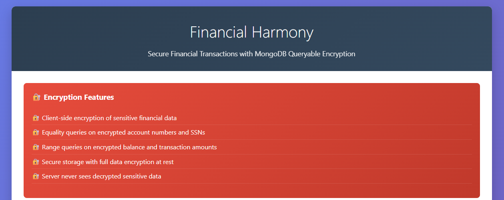
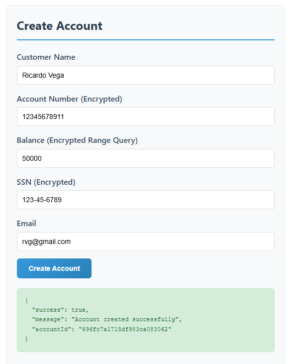
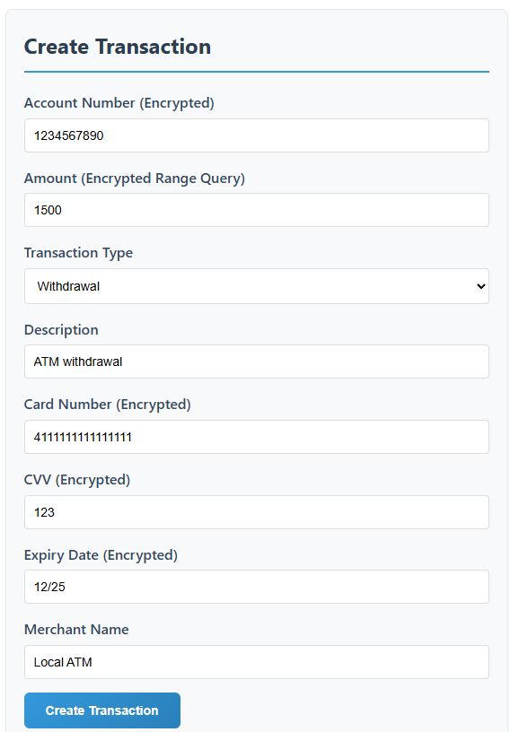
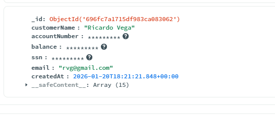

# Financial Harmony 🎵💸

**Financial Harmony** is a demonstration project showcasing **MongoDB Queryable Encryption** within a Symfony 8 application. It illustrates how to handle sensitive financial data (like SSNs, account numbers, and balances) securely, ensuring that the database only ever sees encrypted data while still allowing the application to perform rich queries (equality and range) on that data.

## 🚀 Key Features

- **Client-Side Field Level Encryption (CSFLE)**: Sensitive fields are encrypted by the application _before_ being sent to the database.
- **Queryable Encryption**:
    - **Equality Queries**: Search for accounts by exact SSN or Account Number, even though they are encrypted.
    - **Range Queries**: Search for accounts or transactions within a specific balance or amount range (e.g., `balance > 50000`).
- **Secure Architecture**: The database server never possesses the decryption keys.
- **Modern Stack**: Built with Symfony 8, PHP 8.4, and Doctrine MongoDB ODM 5.5.

## 📸 Screenshots

### Home & Dashboard

The modern, responsive UI allows for easy interaction with the API.


### Creating Protected Accounts

Data entered here is encrypted immediately. The 'Balance', 'SSN', and 'Account Number' are never stored in plain text.


### Secure Transactions

Transaction amounts and credit card details are encrypted.


### Encrypted Storage

This is what the data looks like in the MongoDB database. It is completely unreadable without the keys.


## 🛠️ Technology Stack

- **Framework**: Symfony 8
- **Language**: PHP 8.4
- **Database**: MongoDB 7.0+ (Enterprise or Atlas required for Queryable Encryption)
- **ODM**: Doctrine MongoDB ODM
- **Encryption**: `libmongocrypt` & `mongocryptd` / `crypt_shared`

## ⚙️ Prerequisites

1.  **PHP 8.4** setup with `mongodb` extension.
2.  **MongoDB Server** running locally or via Atlas.
3.  **MongoDB Crypt Shared Library** or `mongocryptd` installed (required for encryption).
4.  **Composer**.

## 📥 Installation

1.  Clone the repository:

    ```bash
    git clone https://github.com/rvega1204/PHP-Symfony-Encrypted-Financial-Harmony.git
    cd PHP-Symfony-Encrypted-Financial-Harmony
    ```

2.  Install dependencies:

    ```bash
    composer install
    ```

3.  Configure your environment:
    Copy `.env` to `.env.local` and configure your MongoDB connection string and encryption paths.

    ```env
    # .env.local
    MONGODB_URL=mongodb://localhost:27017
    MONGODB_DB=financial_harmony

    # 96-byte base64 encoded local key (for demo purposes)
    MONGODB_ENCRYPTION_KEY=your_base64_key_here

    # Path to the crypt_shared library
    MONGODB_CRYPT_SHARED_LIB_PATH=/path/to/mongo_crypt_v1.dll
    ```

## 🏃 Usage

### 1. Web Interface (Demo UI)

Start the built-in PHP server to use the frontend:

```bash
php -S 127.0.0.1:8000 -t public
```

Visit `http://127.0.0.1:8000` in your browser.

### 2. Populate Demo Data

Run the custom console command to populate the database with dummy encrypted data:

```bash
php bin/console app:demo-data
```

You will see output indicating successful account and transaction creation.

### 3. API Endpoints

The application exposes several endpoints for testing:

- `POST /api/harmony/accounts` - Create a new account.
- `POST /api/harmony/transactions` - Create a new transaction.
- `GET /api/harmony/accounts/{accountNumber}` - Find account (Equality Query).
- `GET /api/harmony/accounts/balance-range?min=X&max=Y` - Find accounts by balance (Range Query).
- `GET /api/harmony/transactions/amount-range?min=X&max=Y` - Find transactions by amount (Range Query).

## 🧪 Testing

The project includes a PHPUnit test suite. The tests use mocks to ensure business logic is verified without needing a live database connection.

To run the tests:

```bash
php bin/phpunit
```

## 📂 Project Structure

- `src/Document`: MongoDB Documents (`Account`, `Transaction`) containing encryption annotations.
- `src/Service`: `FinancialService` handling the business logic and interaction with DocumentManager.
- `src/Controller`: `FinancialController` managing the HTTP API and responses.
- `src/Command`: `DemoDataCommand` CLI tool for generating seed data.
- `tests/`: Unit tests mirroring the Service and Controller structure.
- `public/`: Entry point and the standalone HTML frontend (`index.html`).

## 📄 License

This project is licensed under the **MIT License**.

🎓 **Free for Students**: This project is perfectly free for students and educational use. You can use it to learn, modify, and distribute as part of your studies.

---

## 📝 Author

Ricardo Vega 2026

---

_Built with ❤️ for the Symfony & MongoDB Community_
